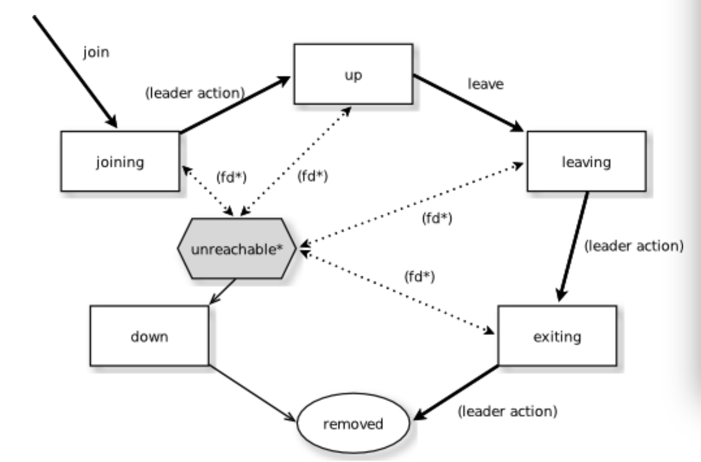
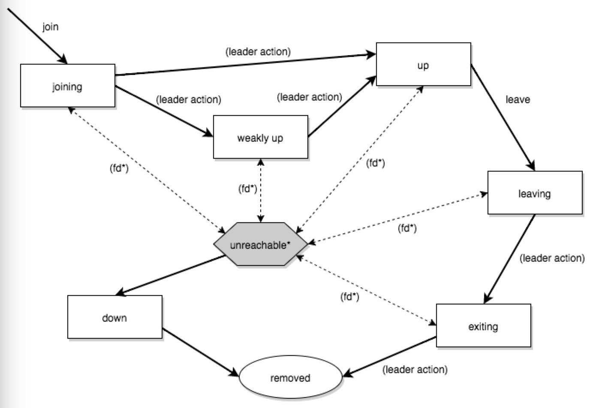

# 5.1 集群规范 

注意：本文档介绍了集群的设计理念。它分成两部分，第一部分描述了当前已经实现的部分，第二部分描述了未来要增强/增加的部分。对未现部分的引用被用脚注[*]标出。 

## 5.1.1 简介 
Akka集群提供了一个容错的、去中心化的、基于点对于点的集群成员关系服务，没有单点故障，也没有单点瓶颈。它使用gossip协议和一个自动故障检测器来实现这些功能。

## 5.1.2 术语
**节点** 集群的一个逻辑成员。在一个物理机器上可以有多个节点。使用hostname:port:uid的元组来标识。 

**集群** 通过成员关系服务组合在一起的一些节点。 

**leader** 集群中的唯一一个作为leader的节点。管理集群收敛，分区[*]，容错[*]，再平衡(rebalancing)[*]等。 

## 成员关系
　　一个集群由一组成员节点构成。每个节点的标识符是一个由hostname:port:uid组成的元组。一个Akka应用程序可以分布于一个集群中，每个节点做为部分程序的宿主。集群的成员关系和在节点上运行应用程序的actor是解耦的。一个节点可以是一个集群的成员，同时不做为任何actor的宿主。想要加入一个集群，需要向目标集群中的任一节点发起一个Join命令开始。 
    节点标识符内部包括一个UID,来唯一标识hostname:port处的那个actor system。Akka使用这个UID来可靠地触发远程死亡监视(remote death watch)。这意味着同一个actor system一旦被从集群中移除就再不能加入这个集群。想要把一个有着同样hostname:port的actor system重新加入集群，你必须着先停止这个actor system, 并且用同样的hostname:port启动一个新的actor system，这个新的actor system将会获得一个不同的UID。 
　　集群成员关系状态是一个专门的CRDT，这意味着它有一个收敛的合并函数。当改变并发地发生于不同节点时，这些更新总能被合并以及收敛为同样的最终结果。 
###Gossip
　　Akka使用的集群成员关系基于Amzaon的Dynamo系统，尤其是Basho‘s的Riak分布式数据库所采用的方法。集群成员通过Gossip协议进行交流，当前集群的状态随机地在集群中传播，并且倾向于传向那些还没有接收过最新状态的成员。 
####向量时钟  
　　向量时钟是一种数据结构和算法，用来在分布式系统中生成事件的偏序关系并且检测违背因果关系的情况。 
　　我们使用向量时钟来在流言传播过程中合并集群状态的差异，并且使其一致。向量时钟是一对一对(节点，计数器)的集合。每次集群状态的更新都会附带对向量时钟的更新。 
####Gossip收敛
   关于集群的信息在某个时间点在本地收敛。这个时间点就是当一个节点能够证明它现在观察到的集群状态已经被集群其它所有的节点观察到。通过在流言传播过程中传递已经看到当前状态的节点集来实现收敛。此信息在gossip概述中被称为已见集合(seen set)。当所有的节点都在已见集合中时，就会有一次收敛。 
　　只要有任何节点处于不可达(unreachable)状态，流言收敛都不会发生。该节点需要重新变成可达(reachable)，或者变成失效(down)和已移处(removed)状态(参见下节中的`成员关系生命周期`)。这只是阻止leader进行集群成员关系管理，并不影响运行于集群之上的应用程序。例如，这意味着，在网络分区时，无法往集群中增加更多节点。节点可以加入，但直到不再分区或者不可达的节点变成失效(down)，他们才能被移动到启用(up)状态。 
###故障探测器
   故障探测器用于检测一个节点对于集群的其它节点是否是不可达的。为此我们使用了对Hayashibara等人的[The Phi Accrual Failure Detector](http://www.jaist.ac.jp/~defago/files/pdf/IS_RR_2004_010.pdf)的一个实现。 
　　累积故障检测器把监控和解释解耦合。这使得它们适用于更广阔的场景，并且更胜任于构建通用的故障检测服务。它的思想是：通过计算从其它节点收到的心跳信息来维护一个故障历史记录，通过考虑多个因素、以及它们随时间的累积来做有依据的猜测，来对一个节点是up还是down做一个更好的猜测。它返回一个phi值代表一个节点down的可能性，而不是简单地对“这个节点是否down了？”这个问题做“是”或“否”的回答。 
　　这项计算所依据的阀值是由用户设置的。一个较低的阀值容易产生很多错误的猜测，但是当一个真正的故障(crash)发生时，它能保证快速发现。与此相对的是，高阀值会产生成少的错误，但是会花更多的时间才能检测到实际发生的故障。默认阈值为8，适合于大多数情况。然而，在云环境中，比如Amazon EC2，该值可以提高到12，以应对在这样的平台上有时会发生的网络问题。 
　　在集群中，每个节点被一些(默认最大为5)其它节点监控，当其中任何一个监测点节检测到这个被监测节点不可达，这个不可达信息就会通过流言传播到节点的其它部分。换句话说，只要有一个节点标记某节点不可达，集群中的其它节点都会标记这个节点不可达。 
监控节点从一个哈希有序的节点环（hashed ordered node ring)的相邻节点中选出。这是为了增加跨机架和数据中心监控的可能性，但是这个顺序(译注：即上一句中的“有序”)对于所有节点都是相同的，这样保证了完全收敛。 
　　心跳每一秒发送一次，每个心跳由一个请求/回复握手来实现，其中的回复被用于故障检测的输入。 
故障检测也会检测一个节点是否重新变成可达。当所有负责检测那个不可达节点的节点都检测到它重新变成可达，在流言扩散以后，这个节点被视为可达。 
　　如果系统消息不能被送达一个节点，这个节点将被隔离，并且它再不能从不可达状态中回来。如果有太多未确认的系统消息（比如watch, Terminated,actor远程部署，由远程家长监督的actor失效), 就可能会发生这种情况。然后这个节点需要被移动到down或者removed状态(见下节的成员关系生命周期)，并且这个actor system需要在重新加入集群之前重启。 
###leader   
   流言收敛之后，可以确定一个集群的leader。 
　　并不存在leader选举的过程，无论何时发生了流言的收敛，任何节点都总能确定地识别leader.leader只是一个角色，任何节点都可以成为leader，并且它可以在收敛的轮次之间改变。leader仅仅是可以承担领导角色的节点进行排序后的第一个节点，leader更倾向于的成员状态是up和leaving(参见下面关于成员关系生命周期的一节中关于成员状态的内容） 
leader的职责是把成员移进和移出集群，将加入集群的成员改为up状态或者把成员移出至removed状态。当前leader的行为只在流言收敛，接收到一个新的集群状态时被触发。 
　　如果进行了配置，leader也可以拥有"自动关闭“(auto-down)一个故障检测器认为不可达的节点的权利。这意味着在配置的不可达时间过去后，自动设置不可达节点的状态为down。 
种子节点是被配置为作为新节点加入集群时的联系点。当一个新节点启动时，它给所有的种子节点发送一条消息，然后发送join命令给第一个回复的种子节点。 
　　种子节点的配置信对于运行中的集群没有任何影响，它仅与新节点的加入有关，因为它帮助新节点发现联系点来发送join命令。新成员可以发送join命令到集群的任何当前成员，而不仅是种子节点。 

### Gossip协议   
   一个push-pull gossip的变种被用来减少在集群中传播的gossip信息的大小。在push-pull gossip中，发送的是代表当前版本的摘要，而不是实际的值。gossip的接收者可以返回它拥有的更新版本的值，也可以请求它持有的过期版本的新值。Akka使用单一的共享状态，以一个向量时钟来做版本控制。所以，Akka所使用的push-pull gossip的变种使用此版本来只在需要时推送实际状态。 
　　每隔一段时间，默认为1秒，每个节点选择另一个随机的节点来发起一轮gossip.如果在seen set中的节点少于一半，那么集群会每秒gossip三次而不是一次。这样调整了gossip的间隔，使得在状态改变后，收敛过程的早期传播阶段加速。 
　　选择与哪个节点gossip是随机的，但是倾向于可能还没见到过当前状态版本的节点。在每轮gossip中，如果没有收敛，就使用0.8(可配置)的概率来与一个不在seen set中的节点gossip，也就是，它可能有一个更旧版本的状态。否则的话，就随机与任何活着的节点gossip. 
　　这种存在偏向的选择是一种在状态改变后，在接下来的传播阶段的后期加速收敛的方法。 
　　对于大于400(可配置， 建议根据实际表现配置)个节点的集群，0.8这个概率逐渐降低以避免太多并发的gossip请求压倒单个落后的节点。gossip的接收者通过丢弃进入mailbox时间太长的消息，来保护自己不受过多同时到达的gossip消息的损害。 
　　当集群处于收敛状态时，参与gossip的人只发送包含gossip版本的很小的gossip status信息给被选择的节点。只要集群有所改变(也就是不收敛)，那么就会立即变回有偏向的gossip。 
　　gossip state或者gossip status(译注指某个节点在其集群成员关系生命周期中处于的状态)的接收者可以使用gossip版本(向量时钟)来决定： 
　　1.它有一个gossip state的新版本，此时它会把这个新的gossip state发送给gossip的发送者。 
　　2.它有一个过期的版本。此时，接受者会把它的gossip state给发送者来请求当前状态。 
　　3.它有一个有冲突的版本，此时，这些不同的版本会被合并，然后发送回。 
　　如果发送者和接收者的版本相同，那么gossip state不会被发送或者请求。 
　　gossip的周期性性质对于状态变化有优良的批量效应，比如，往一个节点很快地连续加入多个节点将仅会带来一个要传播到集群其它节点的状态改变 
　　gossip消息使用protobuf序列化，并且使用gzip压缩以减少负载大小。 
###成员关系生命周期   
    节点开始时处于joinning状态。一旦所有节点都看到了这个新节点在尝试加入(通过gossip收敛)，leader将会把这个节点的成员状态设为up. 
　　如果一个节点使用安全的、符合预期的方式离开集群，它会切换为leaving状态。一旦leader看到对于处于节点的状态收敛于leaving状态，leader将会把它置于exiting状态。一旦所有节点都看到了这个exiting状态(收敛), leader将会把这个节点从集群移除，把它标记为removed状态。 
　　如果有节点不可达，那么gossip收敛就不可能，因此任何leader行为也都不可能(比如，允许一个节点成为集群的一部分）为了能够继续，不可达节点的状态必须改变。它必须再次可达，或者被标记为down。如果节点想要重新加入集群，它的actor system必须重启并且重新经历加入集群的步骤。集群可以通过leader，在不可达一段时间以后，auto-down一个节点。 

>注意： 当你启用了auto-down以及故障探测器，如果你不采用措施来关闭不可达的(shut down)节点，那么随着时间推移，你可能会得到很多单节点的集群。这遵循以下事实：不可达的节点很可能也会把集群中的其它节点视为不可达，因此成为自己的leader, 并且形成自已的集群。 

成员状态的状态图(akka.cluster.allow-weakly-up-members=off)

成员状态的状态图(akka.cluster.allow-weakly-up-members=on)

####成员状态
•	joining 加入集群时的短暂状态
•	up 正常工作状态
•	leaving/exiting 优雅地脱离集群时的状态
•	down 被标记为关闭（从此与集群的决定无关)
•	removed 墓碑状态(不再是成员)

####用户动作
•	join 加入一个节点至集群中-可以是显式地，或者，如果在配置中指明了要加入的节点那么可以在启动时自动加入。
•	leave 让一个节点优雅地离开集群
•	down 把一个节点标记为down
####Leader动作
leader有以下职责： 
• 将成员移入移出集群
　　--joinging -> up 
　　--exiting -> removed 
####故障探测以及不可达性
•	fd*    某个监视者节点的故障探测器被触发，使得被监视的节点被标记为不可达
•	不可达*    不可达并不真的是一个成员状态，它更像是一个成员状态的一个额外标志，标识集群不能被这个节点通讯。在不可达之后，故障探测器可以探测到它重新可达并且去除不可达标志。

## 5.1.2 未来对集群的增强和新增 
在提供成员关系之外，提供actor的自动分区(auto partitioning)[*], 切换(handoff)[*],以及集群重新平衡[*]功能 
这些附加的术语在本节中被使用 
分区(partition) [*]　　被分布到集群中的Akka应用中的一个actor或一个actor子树 
分区点(parition point) [*]　　位于分区头部的actor。一个分区围绕着这个点形成。 
分区路径(parition path) [*]　 也被称为actor地址。有actor1/actor2/actor3这样的格式。 
实例计数(instance count) [*]　　一个分区在集群中的实例数量。也被称为分区的N值。 
实例节点(instance node) [*]　　某个actor实例被分配到的那个节点。 
分区表(partition table) [*]　　从分区路径到实例节点集的映射(把node排序，使用排序后的顺序位置来表示一个节点) 
分区[*]

>注意：actor分区还没有实现 

　　actor system中的每个分区(一个actor或者actor子树）被分配置集群中的一个节点集。这个分区头部的actor被称为分区点(parition point)。从分区路径（像"a/b/c"这样的actor地址）到节点实例们的映射被存在分区表里，并且被使用gossip协议作为集群状态的一部分维护。分区表仅由leader节点更新。当前只有路径节点(routed actors)可以被作为分区点。 
　　路由节点可以有一个大于1的实例计数。实例计数也被称为N值。如果N值大于1，那么在分区表里会给出一个实例节点集合。 
　　注意在第一版实现里可能会限制只有顶级的分区是可行的（只使用能用的最高的分区点，子分区是不被允许的)。还需要做更详细的探讨。 
　　Cluster使用两个坐标来决定一个分区的当前实例数：容错和扩展。 
　　容错决定了一个路由actor的最小实例数目(允许在N-1个节点崩溃时，至少有一个运行中的actor实例)。用户可以指定一个从当前节点数目至可允许的失效节点数的函数：n: Int => f: Int where f < n.  
　　扩展性反应了维持良好的吞量所需要的实例数，受到系统的度量结果的影响，特别是mailbox大小的历史，CPU负载，以及GC百分比。它也可能会接受用户输入的对扩展性的暗示，这些暗示标识了期望负载。 
　　分区的平衡在第一版实现中可以用一个非常简单的方式确定，在这种方式中分区的重叠被最小化。分区被以循环的方式分布在集群环中，每个实例节点在第一个可用的空间中。如果，一个集群有10个节点和三个分区，A,B,C， 它们的N值分别是4, 3, 5；分区A的实例将会在节点1-4上；分区B的实例将会在节点5-7上；分区C的实例将会在节点8-10和1-2上。唯一的重叠在节点1和2. 
　　但是，分区的分布没有限制，不限于把实例分布在在排序后的环(译注：指cluster ring)的相邻节点上。每个实例都可以被分配给任意节点，更加先进的负载平衡算法可以利用这点。分区表包含从路径来实例节点的映射。上面例子的分区将是： 
>A -> { 1, 2, 3, 4 }
B -> { 5, 6, 7 }
C -> { 8, 9, 10, 1, 2 }

 如果5个新节点加入集群，并且按照排序后的顺序，这些节点分别在当前节点2，4，5，7和8之后，那么分区表将会被更新为如下，每个实例还在之前的物理节点上。 
>A -> { 1, 2, 4, 5 }
B -> { 7, 9, 10 }
C -> { 12, 14, 15, 1, 2 }

当需要再重平衡时，leader将安排切换，gossip待进行的改变，等到每个改变都完成，leader就会更新分区表。  
leader的额外职责
在把一个节点从joining状态入成up状态以后，leader可以分配分区[*]给新节点，当一个节点正在离开(is leaving)，leader将会把分区在集群中重新分配[*](也可能正在离开的节点自己是leader)。当所有分区切换[*]已经完成，节点会变为exiting状态。 
在收敛时，leader可以在集群中安排重平衡(rebalancing)，但是用户也可以通过指定如何迁移(migration)来重新平衡集群，或者根据成员节点的度量数据自动地重新平衡集群。度量结果可以通过gossip协议传播，也可以一个随机弦方法(random chord method)更有效地传播，即，leader联系集群环(cluster ring)上的一些随机的节点，每个节点收集它的直接相邻节点的数据，这样可以得到关于负载信息的随机采样。 
切换(Handoff)
　　基于actor的系统进行切换，和基于数据的系统进行切换是不同的。最重要的一点是消息顺序（从一个特定节点到一个特定的actor实例）可能需要被保持。如果这个actor是一个单例actor(在整个集群中只能有一个实例)，那么集群需要确定在任何时间只有一个这样的节点在活动。这些情况都可以通过在切换时转发以及缓存消息来解决。 
　　给定一个前宿舍节点N1,一个新宿主节点N2,一个需要从N1迁移到N2的actor分区A，那么一个优雅地切换有以下主要结构： 
	1.	leader设置一个把A从N1切换到N2上的待办改变(pending change)
	2.	N1注意到了这个待办改变，向N2发送一个初始化(initialization)消息
	3.	作为回应，N2创建A, 发送回一个就绪(ready)消息
	4.	在收到就绪消息以后，N1把改变标记为完成，并且关闭A
	5.	leader观察到迁移已经完成，更新分区表
	6.	所有节点最终看到新的分区，并且使用N2
转变(Transitions)　在切换过程中有数个转变期，其中不同的步骤可以用来提供不同的保证。 
迁移转变(Migration Transition)　　第一个转变起始于N1初始化对A的转移，结束于N1收到了就绪消息，被称为迁移转变。 
第一个问题是：在迁移转变中，应该： 
	•	N1继续处理A的消息？
	•	或者，是否需要一旦迁移开始，就不在N1上处理A的消息
　　如果允许之前的宿主节点N1在迁移过程中处理消息，那么此时就没什么好做的。 
　　如果在迁移过程中消息不在前宿主节点处理，那么接下来有两种可能性：消息被转发到新宿主并且缓冲，直到actor就绪；或者，简单地关闭actor，使得消息被丢充，并且允许使用正常的dead letter处理过程。 
 更新转变(Update Transition)　　第二次转变起始于迁移被标记为完成，结束于所有节点获得到更新后的分区表(当所有节点都采用N2做为A的宿主,比如，收敛后)，被称为更新转变。 
　　一旦更新转变开始，N1可以把它收到的任何发给A的消息转发给新宿主N2.现在的问题是消息的顺序是否需要保留。如果发送给先前宿主N1的消息被转发，那么可能一个发给N1的消息在一个直接发给新节点N2的消息之后才被转发，这样就破坏了从客户端到actorA的消息顺序。 
　　在这种情况下,N2可以保存一个对应于每个发送节点的缓冲区。当一个确认(ACK)消息收到后，对应的缓存区被flush以及移除。集群中每个节点看到分区更新以后，首先发送一个确认消息给先前的宿主节点N1，然后再使用N2做为A的新宿主。任何从客户节点直接发给N2的消息会被放进缓冲区。N1可以递减ACK的数量来确认不再需要转发。来自于任何节点的ACK消息总是在其它发给N1的消息之后。当N1收到ACK消息之后，它同样把它转发给N2, 同样的，这个ACK消息将来在任何已经替A转发的其它消息之后。当N2收到ACK消息之后，用于发送者节点的缓冲区就可以flush以及移除了。任何后续的从这个发送节点发送的消息就可以正常的进行队列。一旦所集群中的所有节点都已经确认了分区的变化，并且N2已经清空了所有的缓冲区，那么切换就完成了，并且消息顺序也得到了保留。在实际上，缓冲区应该保持较小，因为只有那些在ACK被转发前直接发送给N2的消息才需要被缓冲。 
优雅切换(Granceful Handoff)　　一个更加完整的优雅切换的流程是： 
	1.	leader设置一个待办的改变，要求N1把A切给至N2
	2.	N1注意到了这个待办的改变，发送给N2一个初始化消息。选择有：
(a) 使A仍然在N1在保持活跃，继续像平常一样处理消息 
(b) N1把所有发给A的消息转发给N2 
(c) N1丢弃所有发给A的消息(关闭A，使发给A的消息变为dead letter） 
　　3.  作为回应，N2新建A，发送回ready消息。选择有： 
　　(a) N2像平常一样处理发送给A的消息 
(b) N2为每个发消息到A的节点创建一个缓冲区。当来自于某个发送节点的确认消息收到以后(通过N1)，open(flush并移除)相应的缓冲区。 
4.  在收到ready消息后，N1把改变标记为已完成。选择有： 
(a) 在更新转变(udpate transition)中，N1把所有发给A的消息转发给N2 
(b) N1丢弃所有发送给A的消息(关闭A，所有发给A的消息成为dead letter) 
5.  leader发现迁移已经完成，更新分区表 
6.  所有节点最终看到新的分区，并且使用N2 
(a) 每个节点一个确认消息给N1 
(b) 当N1收到一个确认消息，它就把待确认的节点数减1，当所有节点都确认，它就不再转发消息 
(c) 当N2收到了确认消息，它就可以open相应发送者节点的缓冲区(如果使用了缓冲区的话) 
默认的方法是采用2a, 3a和4a选项-允许位于N1上的A在迁移期间继续处理消息，然后在更新转换过程中转发所有消息。这样是基于对无状态actor的假设，假设actor并不依赖于对于任何给定消息源的消息的顺序。 
	•	如果actor有持久化的状态，那么只要迁移actor就行了，别的都不需要做
	•	如果在更新转换期间需要保持消息的顺序，那么可以采用3b的选项，为每个发送节点创建一个缓冲区
	•	如果actor对于消息发送失败是鲁棒的，那么可以采用丢弃消息的方案(不需要转发，也不需要缓冲)
	•	如果actor是单例的(在整个集群中只有一个)，并且在迁移初始化时状态被转移了，那么需要采用2b和3b选项。
有状态actor的复制(Stateful Actor Replication)[*]

 有状态的actor的复制尚未实现。 

[*] 尚未实现
	•	Actor分区
	•	Actor切换
	•	Actor再平衡
	•	有状态actor的复制 

