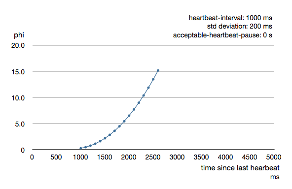
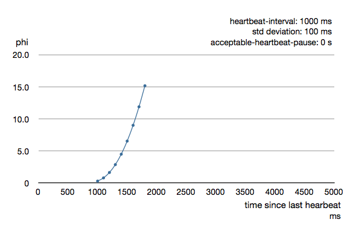
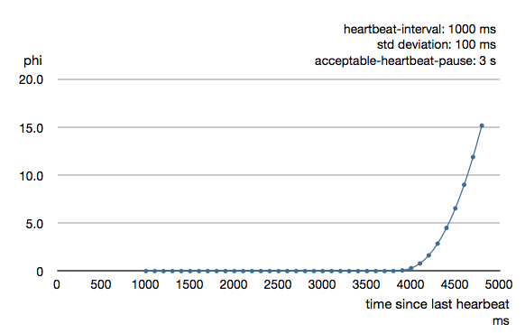

# 远程

> 注：本节未经校验，如有问题欢迎提issue

要了解关于Akka的远程调用能力的简介请参阅[位置透明性](../chapter2/06_location_transparency.md).

> 注意

> 正如那一章所解释的，Akka remoting是按照端到端（peer-to-peer）对等通信的方式设计的，并在建立客户端-服务器（client-server）模式时受到限制。特别是Akka Remoting除其他外，不能与网络地址转换（Network Address Translation）和负载均衡器（Load Balancer）一起工作。

###使你的ActorSystem作好远程调用的准备
Akka 远程调用功能在一个单独的jar包中. 情确认你的项目中包括以下依赖:

    "com.typesafe.akka" %% "akka-remote" % "2.3.6"

要在Akka项目中使用远程调用，最少要在 ``application.conf`` 文件中加入以下内容:

```
akka {
  actor {
    provider = "akka.remote.RemoteActorRefProvider"
  }
  remote {
    enabled-transports = ["akka.remote.netty.tcp"]
    netty.tcp {
      hostname = "127.0.0.1"
      port = 2552
    }
  }
}
```

从上例中可以看到你开始时需要加入4个东西:

* 将 provider 从 ``akka.actor.LocalActorRefProvider`` 改为 ``akka.remote.RemoteActorRefProvider``
* 增加远程主机名——你希望运行actor系统的主机; 这个主机名与传给远程系统的内容完全一样，用来标识这个系统，并为后续根据需要连接回这个系统时使用, 所以要把它设置成一个可到达的IP地址或一个可以正确解析的域名来保证网络可访问性.
* 增加端口号——actor 系统监听的端口号，`0`表示让它自动选择

> 注意

> 端口号对相同机器上的actor系统必须是唯一的，即使actor系统具有不同的名称。这是因为每个actor系统有其自身网络子系统，来监听连接并处理消息，以免与其他actor系统干扰。

上例只是演示了要进行远程调用所需要添加的最小属性。所有的设置在[远程调用配置](#remote-configuration-scala)一节中描述。

###远程交互的类型
Akka 远程调用有两种方式:

* 查找 : 使用``actorSelection(path)``在远程主机上查找一个actor
* 创建 : 使用``actorOf(Props(...), actorName)``在远程主机上创建一个actor

下面章节将对这两种方法进行详细介绍.

###查找远程 Actors
``actorSelection(path)``会获得远程结点上一个Actor的``ActorSelection``, 例如:

```scala
val selection =
  context.actorSelection("akka.tcp://actorSystemName@10.0.0.1:2552/user/actorName")
```

可以看到以下模式被用来在远程结点上查找一个actor:

    akka.<protocol>://<actor system>@<hostname>:<port>/<actor path>

一旦得到了actor的selection，你就可以像与本地actor通讯一样与它进行通迅, 例如:

    selection ! "Pretty awesome feature"

要获得 `ActorSelection`的 `ActorRef` 你需要发送一条消息到selection，然后使用actor答复中的``sender``引用。有一个内置的``Identify``消息所有Actor都会理解并自动回复一个包含 `ActorRef` 的 ``ActorIdentity`` 消息。这也可以通过 ``ActorSelection``的``resolveOne``方法实现，它返回一个包含匹配``ActorRef``的``Future``。

> 注意

> 要了解更多actor地址和路径的组成、使用的详细信息, 请参考 [Actor 引用，路径和地址](../chapter2/05_actor_references_paths_and_addresses.md).

###创建远程 Actor
在Akka中要使用远程创建actor的功能，需要对 ``application.conf`` 文件进行以下修改 (只显示deployment部分):

```
akka {
  actor {
    deployment {
      /sampleActor {
        remote = "akka.tcp://sampleActorSystem@127.0.0.1:2553"
      }
    }
  }
}
```

这个配置告知Akka当一个路径为``/sampleActor``的actor被创建时，即使用``system.actorOf(Props(...), "sampleActor")``时，要进行响应. 指定的actor不会被直接实例化， 而是远程actor系统的daemon会被要求创建这个actor, 本例中的远程actor系统是 ``sampleActorSystem@127.0.0.1:2553``.

一旦配置了以上属性你就可以在代码中进行如下操作:

```scala
val actor = system.actorOf(Props[SampleActor], "sampleActor")
actor ! "Pretty slick"
```

actor类``SampleActor``必须在运行时可用, 即，actor系统的classloader中必须有一个包含这个类的JAR包.

> 注意

> 当创建actor传递构造函数参数时，为了确保``Props``的序列化特性，不要是内部类作为工厂：它将天生地捕获其封闭对象的引用，而在大多数情况下对象的引用是不可序列化的。最好在actor类的伴生对象中创建工厂方法。

> 通过设置配置项目``akka.actor.serialize-creators=on``，所有Props的序列化都可以被测试。只有其``deploy``具有``LocalScope``的Props会被免除这一检查。


> 注意

> 你可以使用星号作为通配符匹配actor路径，因此你可以指定：``/*/sampleActor``，并匹配该树形结构中那一级别上的所有 ``sampleActor``。你也能在最后一个位置使用通配符来匹配某一级别的所有actor：``/someParent/*``。非通配符匹配相比之下总是有更高的优先级，所以：``/foo/bar``被认为比``/foo/*``**更具体**，并且只有优先级最高的匹配才会被使用。请注意它**不能**用于部分匹配，像这样：``/foo*/bar``, ``/f*o/bar``等。

#####用代码进行远程部署
要允许动态部署系统，也可以在用来创建actor的`Props`中包含deployment配置 : 这一部分信息与配置文件中的deployment部分是等价的, 如果两者都有，则外部配置拥有更高的优先级.

加入这些import:

```scala
import akka.actor.{ Props, Deploy, Address, AddressFromURIString }
import akka.remote.RemoteScope
```

和一个像这样的远程地址:

```scala
val one = AddressFromURIString("akka.tcp://sys@host:1234")
val two = Address("akka.tcp", "sys", "host", 1234) // this gives the same
```

你可以像这样建议系统在此远程结点上创建一个子actor:

```scala
val ref = system.actorOf(Props[SampleActor].
  withDeploy(Deploy(scope = RemoteScope(address))))
```

###生命周期和故障恢复模式


每个远程系统的链接可以在上面所示的四个状态之一。对一个给定``Address``的远程系统，在任何通信发生之前，其链接状态为``Idle``。第一次，一条消息试图发送到远程系统，或一个呼入连接被接受，则链接状态变为``Active``，表明两个系统有消息来发送或接收，并且目前没有发生失败。当通信发生故障和两个系统之间失去连接时，链接变为``Gated``。

在这个状态下，系统不会尝试连接到远程主机，并将丢弃所有出站消息。链接处于``Gated``状态的时间由设置``akka.remote.retry-gate-closed-for``控制： 这个时间过去后链接状态会重新变为``Idle``。``Gate``从某种意义上是单方面的，在``Gate``状态下的任何时候，一个*入站*连接被成功接受，它将自动转为``Active``并且通信会立即恢复。

面对因为参与系统的状态不一致导致的无法恢复的通信失败，远程系统变为``Quarantined``。与``Gate``不同，隔离是永久性的，并一直持续到其中一个系统重新启动。重新启动后通讯可以再度恢复，并且链接可以重新变为``Active``。

###监视远程actor
监视一个远程actor与监视一个本地actor没有不同，如[使用DeathWatch进行生命周期监控](../chapter3/01_actors.md#deathwatch-scala)中所述。

> 警告

> *警告：* 监视通过``actorFor``获取的``ActorRef``在失去连接时不会触发``Terminated``消息。``actorFor``是被``actorSelection``取代的废弃方法。应监视通过``Identify``和``ActorIdentity``获得的``ActorRef``，如[通过Actor Selection定位Actor](../chapter3/01_actors.md#actorSelection-scala)所描述的。

#####失效检测器
在底层，远程death watch使用心跳消息和一个失效检测器来对网络故障和JVM崩溃生成``Terminated``消息，并对被监视的actor优雅地终止。

心跳到达的时间是由[Phi自增失效检测器](http://ddg.jaist.ac.jp/pub/HDY+04.pdf)的一个实现解释的。

对故障的怀疑级别由名为*phi*的值给定。Phi失效检测器的基本思想是在某个规模上描述*phi*值，来动态地调整以反映当前的网络状况。

*phi*值是这样计算的：

    phi = -log10(1 - F(timeSinceLastHeartbeat))

其中F是正态分布曲线的平均值和标准偏差的估计，从历史的心跳间隔到达次数的累积分布函数。

在[远程配置](#remote-configuration-scala)中你可以调整``akka.remote.watch-failure-detector.threshold``来定义什么样的*phi*值被认为是一个失败。

一个低的``threshold``容易产生许多假阳性反应，但可以确保一个真正崩溃发生时能快速检测到。相反，一个高``threshold``会生成更少的错误，但需要更多的时间来检测真正的崩溃。默认的``threshold``是10，它适合大多数情况。但是在云环境中，如Amazon EC2，该值可增至12来匹配有时会发生在这类平台上的网络问题。

下面的图表说明了*phi*随着距离上次心跳的时间的增加是如何增加的。



Phi是通过历史讲个到达次数的平均值和标准偏差计算的。前面的图表是标准偏差为200 ms的例子。如果心跳到达偏差更小，则曲线会变得更陡峭，即有可能更快地确定故障。标准偏差为 100 毫秒的曲线看起来像这样。



为了能够适应突然的异常，如垃圾收集导致的暂停和瞬态网络故障，失效检测器配置了一个便捷——``akka.remote.watch-failure-detector.acceptable-heartbeat-pause``。你可能想要根据以来的环境调整[远程配置](#remote-configuration-scala)。当``acceptable-heartbeat-pause``被设置为3秒时，曲线看上去像这样。



###序列化
对actor使用远程调用时，你必须保证这些actor所使用的``props``和``messages``是可序列化的. 如果不能保证会导致系统产生意料之外的行为.

更多信息请参阅[序列化(Scala)](04_serialization.md)。

###有远程目标的路由actor
将远程调用与[路由(Scala)](../chapter3/06_routing.md)进行组合绝对是可行的.

远程部署routees池可以这样被配置:

```
akka.actor.deployment {
  /parent/remotePool {
    router = round-robin-pool
    nr-of-instances = 10
    target.nodes = ["akka.tcp://app@10.0.0.2:2552", "akka://app@10.0.0.3:2552"]
  }
}
```

此配置设置将克隆10个定义在``remotePool``的``Props``的actor，并将其均匀地分布在两个给定的目标节点上部署。

一个远程actor group可以这样配置：

```
akka.actor.deployment {
  /parent/remoteGroup {
    router = round-robin-group
    routees.paths = [
      "akka.tcp://app@10.0.0.1:2552/user/workers/w1",
      "akka.tcp://app@10.0.0.2:2552/user/workers/w1",
      "akka.tcp://app@10.0.0.3:2552/user/workers/w1"]
  }
}
```

此配置设置将想定义的远程actor路径发送消息。它要求你在远程节点相匹配的路径上创建目标actor。这不是由路由器做的。

###远程处理示例
[Typesafe Activator](http://www.typesafe.com/platform/getstarted)。名为[Akka Remote Samples with Scala](http://www.typesafe.com/activator/template/akka-sample-remote-scala)的教程一并演示了远程部署和查找远程actor。

###可插拔的传输支持
Akka可以为远程系统配置使用不同的传输协议进行通信。此功能的核心部件是`akka.remote.Transport` SPI。传输实现必须扩展这一特质。可以通过设置``akka.remote.enabled-transports``配置键，使其指向一个或多个包含驱动程序说明的配置节，来载入传输。

设置基于SSL驱动程序的Netty作为默认值的示例：

```
akka {
  remote {
    enabled-transports = [akka.remote.netty.ssl]

    netty.ssl.security {
      key-store = "mykeystore"
      trust-store = "mytruststore"
      key-store-password = "changeme"
      key-password = "changeme"
      trust-store-password = "changeme"
      protocol = "TLSv1"
      random-number-generator = "AES128CounterSecureRNG"
      enabled-algorithms = [TLS_RSA_WITH_AES_128_CBC_SHA]
    }
  }
}
```

一个设置自定义传输实现的示例：

```
akka {
  remote {
    applied-transports = ["akka.remote.mytransport"]

    mytransport {
      # The transport-class configuration entry is required, and
      # it must contain the fully qualified name of the transport
      # implementation
      transport-class = "my.package.MyTransport"

      # It is possible to decorate Transports with additional services.
      # Adapters should be registered in the "adapters" sections to
      # be able to apply them to transports
      applied-adapters = []

      # Driver specific configuration options has to be in the same
      # section:
      some-config = foo
      another-config = bar
    }
```

###远程事件
可以监听Akka远程调用中发生的事件，也可以订阅/取消订阅这些事情，你只需要在``ActorSystem.eventStream``中为下面所列出类型的事件注册监听器.

> 注意

> 若要订阅任意远程事件，订阅`RemotingLifecycleEvent`。若要订阅只涉及链接的生命周期的事件，请订阅`akka.remote.AssociationEvent`。

> 注意

> 使用"链接"而不是"连接"一词，反映了远程处理子系统可能使用无连接传输，但链接类似于运输层连接，来维持点到点之间的Akka协议。

默认情况下注册的事件监听器，会记录所有下面描述的事件。此默认值被选为帮助建立一个系统，但一旦完成了这一阶段的项目，一般会选择关掉此日志记录。

> 注意

> 设置``application.conf``中的``akka.remote.log-remote-lifecycle-events = off``来关闭日志记录。


要在链接结束("disconnected")时收到通知，监听 ``DisassociatedEvent``， 这个事件持有链接的方向（传入或传出）和参与方的地址.

要在链接成功建立("connected")时收到通知，监听 ``AssociatedEvent``， 这个事件持有链接的方向（传入或传出）和参与方的地址.

要拦截与链接直接相关的错误，监听 ``AssociationErrorEvent``， 这个事件持有链接的方向（传入或传出）、参与方的地址和``Throwable``原因.

要在远程子系统准备好接受链接时收到通知，监听 ``RemotingListenEvent``，这个事件持有远程监听的地址.

要在远程子系统被关闭时收到通知，监听 ``RemotingShutdownEvent``.

要拦截与远程相关的广泛错误，监听包含``Throwable``原因的``RemotingErrorEvent``.

###远程安全
Akka提供了几种方式来加强远程节点（客户端/服务器）之间的安全：

* 不受信任的模式
* 安全 Cookie 握手

#####不受信任的模式
一旦Actor系统可以远程连接到另一个系统，它原则上可以向包含在该远程系统内的任何一个actor发送任何可能的消息。一个例子是可能会给系统守护者发送``PoisonPill``，关闭该系统。这并非总是符合期望，它可以通过下列设置禁用：

```
akka.remote.untrusted-mode = on
```

对设置了此标志的系统，这禁用了系统消息发送（actor生命周期命令，DeathWatch，等等）和任何继承自``PossiblyHarmful``的消息。客户端应该发送他们，尽管它们会被丢弃和记录日志（在DEBUG调试级别以减少拒绝服务攻击的可能性）。``PossiblyHarmful`` 涉及的预定义的消息，像 ``PoisonPill`` 和``Kill``，但它也可以被添加到用户定义的消息作为标记特质。

通过actor selection发送的消息在不受信任模式下默认是丢弃的，但接收actor selection消息的权限可授予特定的actor，像这样在配置中定义：

```
akka.remote.trusted-selection-paths = ["/user/receptionist", "/user/namingService"]
```

实际的消息仍然必须不能是 ``PossiblyHarmful``类型。

总之，配置为不受信任模式的系统通过远程处理层传入的以下操作将被忽略：

* 远程部署 （这也意味着没有远程监控）
* 远程DeathWatch
* ``system.stop()``, `PoisonPill`, `Kill`
* 发送任何继承自`PossiblyHarmful`标记接口的消息，包括`Terminated`
* 通过actor selection发送的消息，除非目标定义在``trusted-selection-paths``中。

> 注意

> 启用不受信任模式并不会取消客户端能够自由选择其消息发送目标的能力，这意味着不按上述规则禁止的消息可以发送给远程系统中的任何一个actor。对一个面向客户的系统，仅仅包含一组定义良好的入口点actor，然后将请求转发（可能在执行验证后）到另一个包含实际工作者actor的actor系统是一个好的实践。如果两个服务器端系统之间消息传递使用本地`ActorRef`（他们安全地在同一个JVM上的两个actor系统之间交换），你可以通过标记他们为`PossiblyHarmful`来限制此接口上的消息，从而使客户端不能伪造。

#####安全 Cookie 握手
Akka远程处理还允许你指定一个安全cookie，它将被交换并确保在客户端和服务器之间的连接握手中是相同的。如果他们不相同，则客户端将被拒绝连接到服务器。

安全cookie可以是任何类型的字符串。但推荐使用此脚本生成一个加密安全cookie——$``$AKKA_HOME/scripts/generate_config_with_secure_cookie.sh``或者从代码中使用``akka.util.Crypt.generateSecureCookie()``工具方法。

你必须确保连接的客户端和服务器都有相同的一个安全 cookie，并同时打开了``require-cookie``选项。

下面是一个示例配置：

```
akka.remote {
  secure-cookie = "090A030E0F0A05010900000A0C0E0C0B03050D05"
  require-cookie = on
}
```

#####SSL
SSL可以用作远程运输，通过添加``akka.remote.netty.ssl``到``enabled-transport``配置节。请参阅[远程配置](#remote-configuration-scala)以节中的设置说明。

SSL支持是用Java安全套接字扩展实现的，请参阅官方的[Java安全套接字扩展文档](http://docs.oracle.com/javase/7/docs/technotes/guides/security/jsse/JSSERefGuide.html)和相关的资源进行故障排除。

> 注意

> 当在Linux上使用SHA1PRNG时，推荐指定``-Djava.security.egd=file:/dev/./urandom``作为JVM参数形式指定以防止阻塞。它并**不**安全因为它重用了种子。使用'/dev/./urandom'，而不使用'/dev/urandom'是行不通的，见[Bug ID: 6202721](http://bugs.sun.com/view_bug.do?bug_id=6202721)。

###<a name="remote-configuration-scala"></a>远程配置
有很多与Akka远程处理相关的配置属性。可以在[参考配置](../chapter2/09_configuration.md#config-akka-remote)中获取详细信息。(译者注：中文翻译附在本节后面，摘自Akka 2.0的翻译)

> 注意

> 以编程方式设置如监听IP和端口号的属性，最好是通过类似以下内容的方式：

> ```
> ConfigFactory.parseString("akka.remote.netty.tcp.hostname=\"1.2.3.4\"")
>      .withFallback(ConfigFactory.load());
> ```

#####远程配置信息：

```scala
#####################################
# Akka 远程调用参考配置文件 #
#####################################

# 本参考配置文件包含所有的缺省配置.
# 在你自己的 application.conf 可对其进行编辑/重写.

# 关于akka-actor.jar 中已有的akka.actor设置的注释被去掉了, 不然会发生重复设置.

akka {

  actor {

    serializers {
      proto = "akka.serialization.ProtobufSerializer"
    }


    serialization-bindings {
      # 由 com.google.protobuf.Message 没有继承 Serializable 但 GeneratedMessage
      # 有, 这里必须使用更明确的类来避免歧义
      "com.google.protobuf.GeneratedMessage" = proto
    }

    deployment {

      default {

        # 如果设置为一个可用的远程地址, 这个有名称的actor会被部署到那个结点
        # e.g. "akka://sys@host:port"
        remote = ""

        target {

          # 一个主机名和端口列表，用来创建一个非直接路由actor的子actor
          #   格式应为 "akka://sys@host:port", 其中:
          #    - sys 是远程actor系统的名称
          #    - hostname 可以是主机名或远程主机应连接到的IP地址
          #    - port 应为其它结点上的远程服务的端口
          # 象本地路由actor一样，新生成的actor实例的数量仍从
          # nr-of-instances 配置中获取; 新的实例在给定的结点中将以
          # round-robin 的方式分布
          nodes = []

        }
      }
    }
  }

  remote {

    # 使用 akka.remote.RemoteTransport 的哪个实现
    # 缺省是基于TCP，Netty上的远程传输层
    transport = "akka.remote.netty.NettyRemoteTransport"

    # 打开为服务器管理的actor的完全的安全性打开不信任模式, 允许不受信任的
    # 客户端建立连接.
    untrusted-mode = off

    # 集群操作的 ACK 超时, 例如检查 actor 等.
    remote-daemon-ack-timeout = 30s

    # 如果这个值是 "on", Akka 会以DEBUG级别记录所有接收到的消息到日志, 如果是 off 则不会被记录
    log-received-messages = off

    # 如果这个值是 "on", Akka 会以DEBUG级别记录所有发送的消息到日志，如果是 off 则不会被记录
    log-sent-messages = off

    # 每一个属性被标记为 (I) 或 (O) 或 (I&O), I 代表 “输入”  O 代表 “输出” 连接.
    # NettyRemoteTransport 启动的服务器总是允许输入的连接, 当发送到某个尚未连接的目标时总是会启动活跃的客户端连接
    # ; 如果配置指定，它可以重用输入的连接来发送应答，这被称为被动客户端连接
    #  (i.e. 从服务器到客户端).
    netty {

      # (O) 在延迟变长/溢出的情况下要等待多久 (阻塞发送方)
      # 才取消发送
      # 0 表示 "不取消", 任何正数表示最长的阻塞时间.
      backoff-timeout = 0ms

      # (I&O) 用 '$AKKA_HOME/scripts/generate_config_with_secure_cookie.sh' 创建自己cookie
      # 或使用 'akka.util.Crypt.generateSecureCookie'
      secure-cookie = ""

      # (I) 远程服务器是否要求连接对方也共享同样的 secure-cookie
      # (在 'remote' 部分定义)?
      require-cookie = off

      # (I) 重用输入连接来发送消息
      use-passive-connections = on

      # (I) 远程调用所绑定的主机名或ip,
      # 不设则使用InetAddress.getLocalHost.getHostAddress
      hostname = ""

      # (I) 客户端应连接到的缺省远程服务器端口.
      # 缺省值为 2552 (AKKA), 0 表示随机选择一个可用端口
      port = 2552

      # (O) 创建输出连接时绑定到的本地网络接口地址 (IP 地址)
      # 设置为 "" 或 "auto" 表示自动选择本地地址.
      outbound-local-address = "auto"

      # (I&O) 如果你希望发送内容较大的消息则设置这个参数
      message-frame-size = 1 MiB

      # (O) 超时间隔
      connection-timeout = 120s

      # (I) 储备连接的大小
      backlog = 4096

      # (I) 核心线程空闲时保持存活的时间长度，以 akka.time-unit 为单位
      execution-pool-keepalive = 60s

      # (I) 远程执行单元的核心池的大小
      execution-pool-size = 4

      # (I) channel 大小的上限, 0 表示关闭
      max-channel-memory-size = 0b

      # (I) 所有channel总大小的上限, 0 表示关闭
      max-total-memory-size = 0b

      # (O) 活跃客户端重连的间隔
      reconnect-delay = 5s

      # (O) 读非活跃时间 (最小单位为秒)
      # 经过这么长时间后，活跃客户端将被关闭;
      # 当有新的通信请求时将被重新建立.
      # 0表示关闭这个功能
      read-timeout = 0s

      # (O) 写非活跃时间 (最小单位为秒)
      # 经过这么长时间后将发送心跳.
      # 0表示关闭这个功能
      write-timeout = 10s

      # (O) 读和写的非活跃时间 (最小单位为秒)
      # 经过这么长时间后活跃客户端连接将被关闭;
      # 当有新的通信请求时将被重新建立
      # 0表示关闭这个功能
      all-timeout = 0s

      # (O) 客户端应进行重连的最大时间窗口
      reconnection-time-window = 600s
    }

    # 系统 actor "network-event-sender" 所使用的派发器
    network-event-sender-dispatcher {
      executor = thread-pool-executor
      type = PinnedDispatcher
    }
  }
}
```


